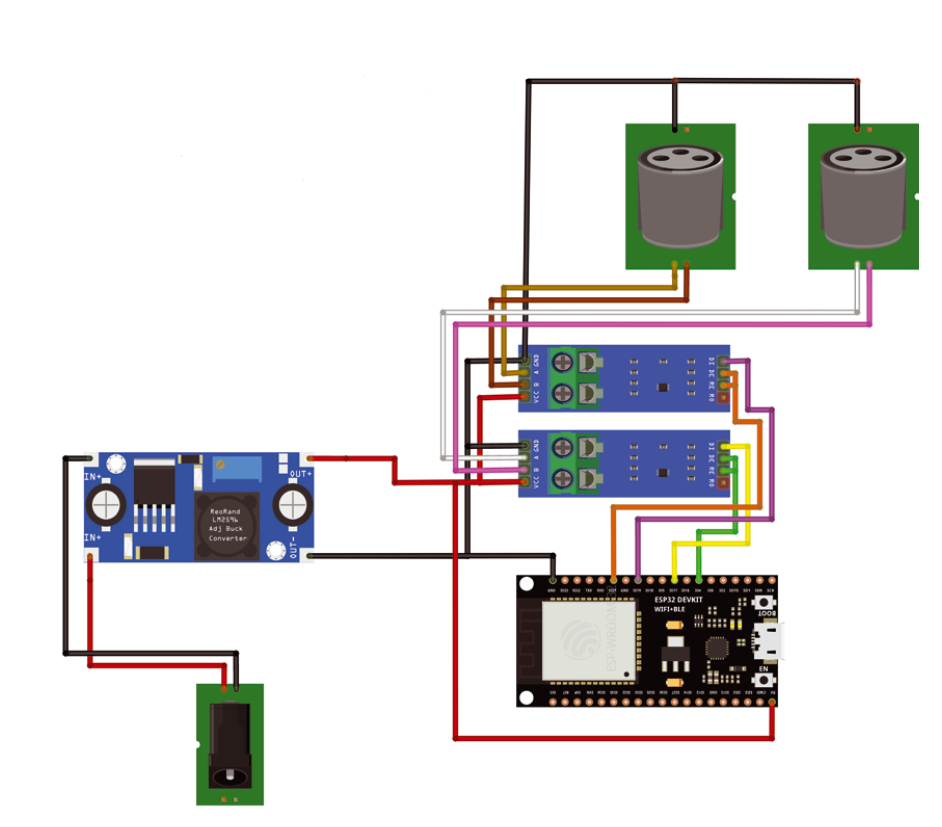

# ESP32-ArtNet-to-DMX

For the English version click [here](README.md).

Questo progetto è un convertitore da ArtNet a DMX basato su un ESP32 e due moduli MAX485.

Questa è una piccola introduzione, tutte le informazioni sono presenti sulla rivista [ElettronicaIN #276](https://futuranet.it/prodotto/n-276-dicembre-2023-gennaio-2024/).

È basato sugli sketch [DMX_write](https://github.com/someweisguy/esp_dmx) di Mitch Weisbord e [ArtNetWifiNeoPixel](https://github.com/rstephan/ArtnetWifi) di rstephan.

---

# Hardware

- Una scheda[ESP32](https://futuranet.it/prodotto/esp32-scheda-di-sviluppo-32-gpio-con-wifi-e-bluetooth/)

- 2 moduli [MAX 485](https://futuranet.it/prodotto/convertitore-ttl-rs485/)

- 2 [connettori XLR 3P da pannello, femmina](https://futuranet.it/prodotto/connettore-xlr-3p-femmina/)

- Un [convertitore DC-DC 5V-3A](https://futuranet.it/prodotto/modulo-dc-dc-stepdown-5v-3a/)

- Cavo USB per il caricamento dello sketch

- Un connettore DC per montaggio a pannello

- Una scatola di plastica per l'elettronica

### Schema di collegamento per i moduli MAX 485 e i connettori XLR

| PIN MAX 485 | Segnale DMX | Pin connettori XLR |
| ----------- | ----------- | ------------------ |
| GND         | GND/Shield  | 1                  |
| A           | Data +      | 3                  |
| B           | Data -      | 2                  |

### 

### Schema di collegamento per i moduli MAX485 e l'ESP32

###### Universo A

| Pin ESP32 | Pin MAX 485 |
| --------- | ----------- |
| 5V        | VCC         |
| GND       | GND         |
| 4         | DE          |
| 17        | DI          |
| 4         | RE          |

###### Universo B

| Pin ESP32 | Pin MAX 485 |
| --------- | ----------- |
| 5V        | VCC         |
| GND       | GND         |
| 21        | DE          |
| 19        | DI          |
| 21        | RE          |

## Schema di collegamento



---

# Software

## Configurazione

```arduino
//#define DHCP_DISABLED

#ifdef DHCP_DISABLED

IPAddress local_IP(192, 168, 1, 154);
IPAddress gateway(192, 168, 1, 1);
IPAddress subnet(255, 255, 255, 0);
IPAddress primaryDNS(192, 168, 1, 1);  //optional
IPAddress secondaryDNS(1, 1, 1, 1);    //optional

#endif

WiFiUDP UdpSend;
ArtnetWifi artnet;

const char* ssid = "MyArtNetNetwork";
const char* password = "MyArtNetNetwork";
```

Modifica lo sketch, cambiando le variabili `ssid` e `password`, adattandole alla tua rete.

Puoi decidere se usare un IP statico oppure usando il DHCP. Per disabilitare il DHCP è sufficiente decommentare l'istruzione `#define DHCP_DISABLED` e settare le variabili `local_IP`, `gateway`, `subnet` e (opzionalmente) `primaryDNS` e `secondaryDNS`.

---

Sentiti libero di editare lo sketch, di migliorarne le funzionalità e di inviare delle pull requests.

Il template del file README è stato preso da [qui](https://github.com/bremme/arduino-project/blob/master/README.md)
