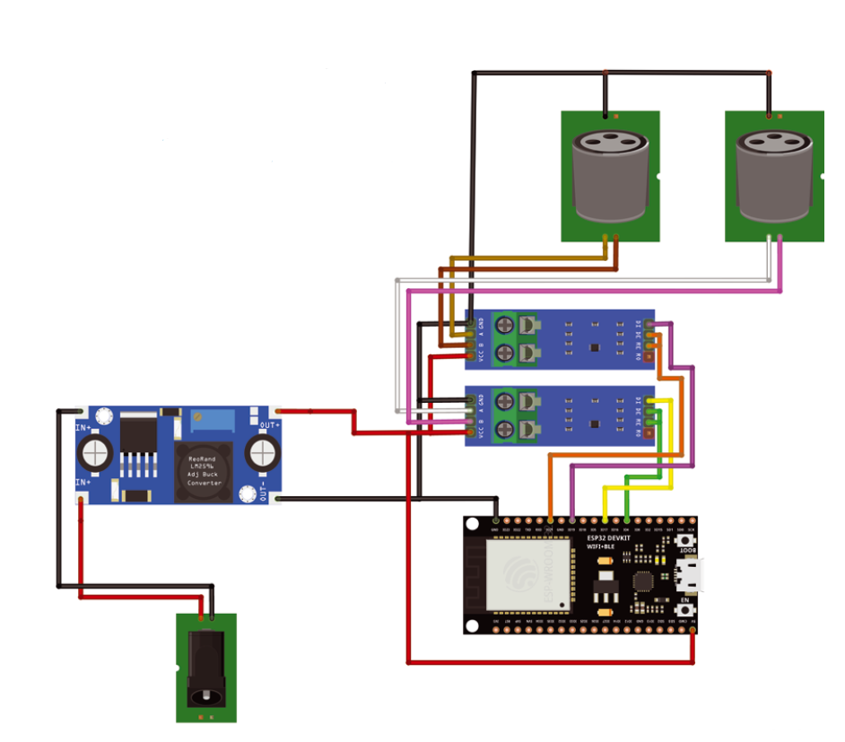

# ESP32-ArtNet-to-DMX

Per la versione in italiano clicca [qui](README-ITA.md).

This is a simple ArtNet to DMX converter based on an ESP32 and two MAX485 modules.

This is a brief introduction to my project published on [ElettronicaIN #276](https://futuranet.it/prodotto/n-276-dicembre-2023-gennaio-2024/).

It is based on the sketch [DMX_write](https://github.com/someweisguy/esp_dmx) by Mitch Weisbord and on the sketch [ArtNetWifiNeoPixel](https://github.com/rstephan/ArtnetWifi) by rstephan.

------

# Hardware

- [ESP32 board](https://store.open-electronics.org/ESPWROOM32_ESP32_ESP-32S_DevelopmentBoard)

- 2 MAX 485 modules

- 2 DMX XLR connectors (female, panel mount)

- DC-DC voltage regulator (5V - 3A)

- USB cable

- DC plug, panel mount

- Platisc box for electronics

### Wiring table for MAX485 and XLR connector

| MAX 485 PIN | DMX Common Name | XLR connector pin |
|:-----------:|:---------------:|:-----------------:|
| GND         | GND/Shield      | 1                 |
| A           | Data +          | 3                 |
| B           | Data -          | 2                 |

### 

### Wiring tables for MAX485 and ESP32

###### Universe A

| ESP32 pin | MAX 485 pin |
|:---------:|:-----------:|
| 5V        | VCC         |
| GND       | GND         |
| 4         | DE          |
| 17        | DI          |
| 4         | RE          |

###### Universe B

| ESP32 pin | MAX 485 pin |
|:---------:|:-----------:|
| 5V        | VCC         |
| GND       | GND         |
| 21        | DE          |
| 19        | DI          |
| 21        | RE          |

## Wiring diagram



----

# Software

## Configuration

```arduino
//#define DHCP_DISABLED

#ifdef DHCP_DISABLED

IPAddress local_IP(192, 168, 1, 154);
IPAddress gateway(192, 168, 1, 1);
IPAddress subnet(255, 255, 255, 0);
IPAddress primaryDNS(192, 168, 1, 1);  //optional
IPAddress secondaryDNS(1, 1, 1, 1);    //optional

#endif

WiFiUDP UdpSend;
ArtnetWifi artnet;

const char* ssid = "MyArtNetNetwork";
const char* password = "MyArtNetNetwork";
```

Modify the sketch, by just changing the variables `ssid` and `password`, adapting them to your network. 

You can decide to use DHCP or static IP. To disable DHCP just uncomment the line `#define DHCP_DISABLED` and set the variables `local_IP`, `gateway`, `subnet` and (optionally) `primaryDNS` and `secondaryDNS`.

-------

Feel free to edit the sketch, to improve the functionalities and to send pull requests.

Readme template taken from [here](https://github.com/bremme/arduino-project/blob/master/README.md)
